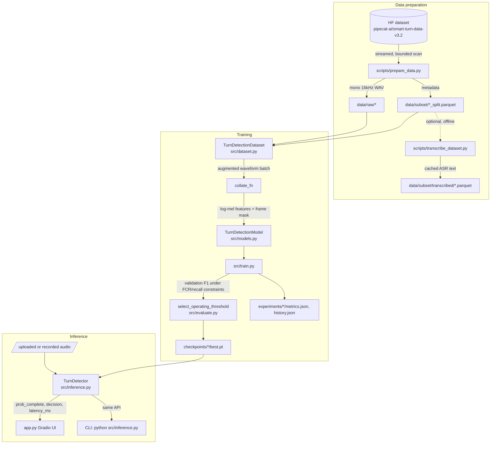

<!-- markdownlint-disable MD013 -->

# Architecture

First-time-reader overview of how data, training, and inference fit together
in this repository. For an evidence-linked, line-referenced version of the
same material, see [`docs/codebase/ARCHITECTURE.md`](codebase/ARCHITECTURE.md).
For the model's internal shape specifically, see [`docs/codebase/STRUCTURE.md`](codebase/STRUCTURE.md)
and [`src/models.py`](../src/models.py).

## System overview

The repository has three independent pipelines that share one config module
(`configs/config.py`) and one model definition (`src/models.py`):

1. **Data preparation** (`scripts/prepare_data.py`, `src/dataset.py`): pulls a
   bounded, filtered slice of a public Hugging Face dataset to local disk and
   writes Parquet metadata plus WAV files.
2. **Training/evaluation** (`src/train.py`, `src/evaluate.py`,
   `scripts/run_experiments.py`, `scripts/select_safety_finalist.py`): fits
   `TurnDetectionModel` against the prepared data and writes checkpoints and
   metrics under `experiments/` and `checkpoints/`.
3. **Inference** (`src/inference.py`, `app.py`, `scripts/download_and_demo.py`):
   loads one checkpoint and serves predictions, either via the Gradio demo
   or the `TurnDetector` Python/CLI API.

## Data preparation

`scripts/prepare_data.py` calls `stream_filtered_subset` (`src/dataset.py`),
which streams the Hugging Face dataset row-by-row (never downloading the full
41.4 GB train split), decodes and resamples audio to mono 16 kHz, and writes
one WAV file per kept row plus a Parquet metadata table. Row selection is
capped by `ROW_SCAN_BUDGET_TRAIN`/`ROW_SCAN_BUDGET_TEST` in
`configs/config.py`, not by a target row count (see the "WHY A BOUNDED SCAN"
comment block at the top of `src/dataset.py`).

`stratified_split` then splits that metadata into train/val/test, stratified
by `(language, endpoint_bool, source_dataset)`. There is no speaker or accent
column in the source data, so a true speaker-disjoint split is not possible
(documented as a known limitation in the root README).

`scripts/transcribe_dataset.py` is a separate, optional step used only for the
multimodal (M1) experiment: it runs frozen `openai/whisper-tiny` ASR over the
prepared splits and caches transcripts to `data/subset/transcribed/`, offline
and label-independent.

## Training

`TurnDetectionDataset.__getitem__` returns a raw `{waveform, label, ...metadata}`
dict; augmentation (silence insertion, speed/pitch/volume perturbation,
background noise, Hinglish filler splicing) happens here, on the fly, per
epoch; no augmented audio is cached to disk. `collate_fn` is the only place
that talks to `WhisperFeatureExtractor`: it left-pads a batch of variable
length waveforms to the fixed 8-second window and builds a frame-level
attention mask (see the "Padding convention" note in `collate_fn`'s
docstring), so that padding never wins attention weight.

`src/train.py` is a hand-written loop (not `transformers.Trainer`; see the
"WHY A CUSTOM LOOP" note at the top of that file): AdamW, cosine LR schedule
with warmup, gradient accumulation, gradient clipping, and optional fp16
mixed precision. Every epoch, validation metrics are computed on
**unaugmented** data, and (when `evaluation.threshold_calibration.enabled`
is set in the run's YAML config) a decision threshold is chosen on
validation probabilities only, constrained to `false_complete_rate` and
`recall` bounds (`src/evaluate.py:select_operating_threshold`). The checkpoint
with the best constrained validation F1 is saved to `<checkpoint.dir>/best.pt`
with its config, metrics, and threshold embedded.

`scripts/run_experiments.py` drives many training runs from one baseline
config plus per-experiment overrides, writing each into its own
`experiments/<name>/` directory. `scripts/select_safety_finalist.py` compares
multiple seeds per architecture and copies the median-performing seed's
checkpoint into `checkpoints/safety_finalist/`, then runs one held-out test
evaluation.

## Model

`TurnDetectionModel` (`src/models.py`) wraps only the encoder half of
`openai/whisper-tiny` (the decoder is loaded once via `from_pretrained` and
then discarded: Whisper ships encoder+decoder together, but this task never
generates text from the audio branch). Encoder positional embeddings are cut
down from Whisper's native 30-second window to 400 positions (an 8-second
window), keeping Whisper's pretrained weights for those first 400 positions
rather than reinitializing them.

A configurable pooling layer (`attention` | `mean` | `last`, in
`_POOLING_REGISTRY`) reduces the encoder's per-frame output sequence to one
384-dimensional vector, which a small MLP head (`Linear(384,256) → LayerNorm
→ GELU → Dropout → Linear(256,64) → GELU → Linear(64,1)`) maps to a single
logit. `MultimodalTurnDetectionModel` subclasses this to additionally embed
and mean-pool cached transcript tokens, concatenating a 64-dim text vector
onto the audio vector before the same classifier shape.

## Inference

`TurnDetector` (`src/inference.py`) is the one place that owns the
audio-in → prediction-out contract; both `app.py` and any external integrator
should go through it rather than reimplementing preprocessing. It accepts a
file path, a bare NumPy array (assumed already 16 kHz), or a
`(waveform, sample_rate)` tuple; validates and normalizes the audio; crops to
the trailing 8 seconds; and runs the same `collate_fn` used in training before
the forward pass. A `threading.Lock` serializes calls to the underlying model
so concurrent Gradio requests don't race on the same `nn.Module`.

For the exact call sequence behind the Gradio demo, see
[`docs/diagrams/inference-sequence.mmd`](diagrams/inference-sequence.mmd),
verified against `app.py` and `src/inference.py` while writing this document
and still accurate.

## External systems

- **Hugging Face Hub**: `datasets.load_dataset` streams
  `pipecat-ai/smart-turn-data-v3.2-train`/`-test` (data prep); `WhisperModel`/
  `WhisperFeatureExtractor`/`WhisperTokenizer`/`WhisperForConditionalGeneration`
  pull `openai/whisper-tiny` weights and configs (training, inference,
  transcription); `scripts/download_and_demo.py` and the optional
  `SPACES_ZERO_GPU=1` path in `app.py` target a user-supplied model repo and
  Hugging Face Spaces respectively. All of this requires network access (or a
  populated local Hub cache) on first run; there is no bundled offline mirror.
- **Microsoft Edge TTS** (`edge-tts` package): `FillerBank` in
  `src/dataset.py` synthesizes Hinglish filler-word audio clips over the
  network, cached to `data/fillers/` after the first run.
- No database, message queue, or other network service is called anywhere in
  `src/`, `scripts/`, or `app.py`.

## Where state lives

| State | Location | Written by |
| --- | --- | --- |
| Raw prepared audio + metadata | `data/raw/{train,test}/`, `data/subset/*.parquet` | `scripts/prepare_data.py` |
| Cached transcripts (M1 only) | `data/subset/transcribed/` | `scripts/transcribe_dataset.py` |
| Cached filler-word TTS clips | `data/fillers/*.wav` | `src/dataset.py:FillerBank` |
| Trained weights + embedded config/threshold | `checkpoints/<name>/best.pt`, `experiments/<name>/checkpoints/best.pt` | `src/train.py` |
| Per-run history/metrics | `experiments/<name>/{history,metrics,test_metrics,result}.json` | `src/train.py`, `scripts/run_experiments.py` |
| Multi-run comparisons | `experiments/comparison.csv`, `experiments/all_results.json`, `experiments/experiment_manifest.json` | `scripts/run_experiments.py` |
| Selected production checkpoint | `checkpoints/safety_finalist/best.pt` + `selection.json` | `scripts/select_safety_finalist.py` |

There is no runtime database. All persistence is flat files (WAV, Parquet,
JSON, and PyTorch `.pt` checkpoints) on local disk.
