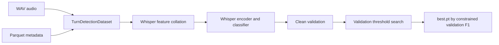

<!-- markdownlint-disable MD013 -->

# Architecture and runtime flow

## Data preparation

`scripts/prepare_data.py` streams bounded portions of the Pipecat train and test
repositories. Accepted rows become mono 16 kHz WAV files with Parquet metadata.
Training and validation come from the publisher train repository. The publisher
test repository remains separate.

The split is stratified by language, endpoint label, and source dataset. It is
not speaker-disjoint because the source has no speaker identity. Hard cases are
marked for weighted sampling rather than copied to disk. Augmentation runs in
memory during training; saved previews exist only for inspection.

## Training

Short clips are left-padded, which keeps the utterance ending aligned. The
encoder still processes padding, but pooling receives a mask. Training uses BCE
loss, AdamW, a cosine schedule, gradient accumulation, clipping, and mixed
precision. Validation never uses augmentation.

## Model

The feature extractor turns at most eight seconds of audio into 800 mel frames.
Whisper produces 400 hidden frames of width 384. A pooling layer reduces this
sequence to one vector. The classifier maps `384 -> 256 -> 64 -> 1`.

The multimodal variant embeds transcript tokens, averages valid token vectors,
and concatenates a 64-dimensional text vector with the audio vector.

## Inference

`app.py` builds the Gradio interface without loading weights. Local startup loads
the detector before opening the server; Spaces can defer that load until the
first request. `TurnDetector` checks the checkpoint, rebuilds the architecture,
loads weights with `weights_only=True`, and creates the feature extractor.

A request is decoded, converted to mono 16 kHz, cropped to its final eight
seconds, collated, and passed through the model. The API returns completion
probability, applied threshold, thresholded decision, and latency. Batch latency is amortized
per item. Threshold defaults to checkpoint value; legacy checkpoints use 0.5.
This is buffered inference, not streaming inference.

## Experiment flow

`scripts/run_experiments.py` copies the baseline config, applies declared
changes, fingerprints metadata, trains each run, and writes machine-readable
results. Validation selects checkpoints. Test evaluation requires the explicit
`--final-test` flag.

`scripts/select_safety_finalist.py` groups completed validation runs by
architecture, requires every seed to meet safety constraints, selects highest
median F1 architecture, copies its median-F1 seed, then performs one final test.

## Evidence

- `src/dataset.py:195`, `:327`, `:669`, `:844`
- `src/models.py:184`, `:320`, `:376`
- `src/train.py:91`, `:139`
- `src/evaluate.py:40`, `:181`, `:271`
- `src/inference.py:102`
- `app.py:68`, `:110`, `:126`
